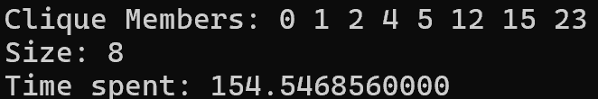
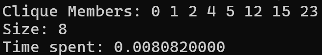

# Find biggest clique in graph

<p align="center">
  <a href="#description">Description</a> •
  <a href="#project-overview">Project Overview</a> •
  <a href="#to-run">To Run</a> •
  <a href="#output-format">Output Format</a>
</p>

## Description  
This code find the biggest clique in a graph.  
This code done in course "Computer Structure" in Bar Ilan University. We received code and had to optimize it.

## Project Overview  
In this task, we are given graph G = (V,E), represented by an adjacency matrix A where -  
* A[i,j] = 1 if there is an edge between vertices 𝑖  and 𝑗 
* A[i,j] = 0 if there is no edge between these vertices  
  
The goal is to find the biggest subset such that for all vertices in the subset there is an edge between them.  

This is a well-known problem in computer science called the Maximum Clique Problem. It is classified as NP-Hard, meaning we currently do not have an algorithm to solve it in polynomial time.  

For this task, we were provided with an existing implementation that solves the problem. Our assignment was to optimize the code and make changes to improve its performance, ensuring it runs faster while maintaining correctness.

## Performance Comparison  

The following images show the program's output before and after optimization:  

### Before Optimization  
<p align="center">
  
</p>  

### After Optimization  
<p align="center">
  
</p>


## To Run  
1. Clone this repository.  

2. Create a text file named `graph.txt` in the project folder.  
   This file should contain the graph's adjacency matrix, which is essential for running the code.
 
 3. **To generate a random graph**, run the following Python script (replace `n` with the desired number of vertices in the graph):
 ```bash
 python create-matrix.py n > graph.txt
 ```

4. **To compile:**
```bash
gcc -O0 main.c max-clique.c -o main
```  

5. **To run:**
```bash
./main < graph.txt
```

## Output Format  
The output of the program will display the following information:
```bash
Clique Members: 0 2 4 5 7 8 12
Size: 7
Time spent: 0.0001590000
```
